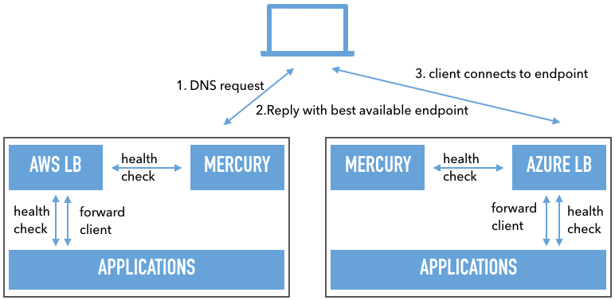
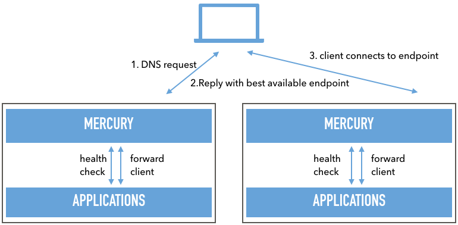
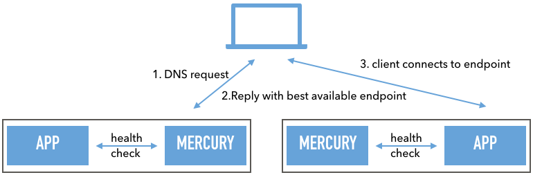

# Example configurations of mercury

Below is a list of example configurations suiting your purpose
Note that these examples provide configuration for 1 out of 2+ nodes. It is recommended to have at least 2 Mercury hosts that can form a cluster.

## Adding Mercury as Global Loadbalancer to existing Loadbalance solutions
If you are using multiple cloud environment you'll notice that they have their 'internal' Global loadbalance mechanisms across their datacenter locations. But very few have the option to add nodes outside of their network. Which results in the need of a extra layer, using DNS to loadbalance across multiple providers or datacenter

Diagram:


Configuration:
```
[settings]
  manage_network_interfaces = "yes" # change this to "no" to not add the listener IP address to the host running Mercury
  enable_proxy = "no"               # this disables all proxy capabilities of Mercury. Useful when only serving as DNS loadbalancer

[cluster]                           # All cluster related documentation
  name = "MY_GLB_POOL"              # Cluster name for all nodes

  [cluster.binding]
  name = "localhost1"               # Our local node name
  addr = "127.0.0.1:9000"           # Our local binding ip/port
  authkey = "test"                  # key other clusters need to use to talk to us

  [[cluster.nodes]]
  name = "localhost2"               # Secondary cluster nodes name
  addr = "127.0.0.1:10000"          # Secondary cluster node ip/port binding
  authkey = "test"                  # Key we need to use to talk to the remote node

[dns]
  binding = "loadbalancer1.example.com"                               # local binding address for dns service
  port = 15353                                                        # local binding port for dns service
  [dns.domains."example.com"]                                         # config for domain 'domain.nl'
    ttl = 11                                                          # set default ttl to 11 seconds

[loadbalancer.settings]
  default_balance_method = "roundrobin"                               # default balance method for all backends

[loadbalancer.pools.INTERNAL_VIP.listener]                            # Define a pool 'INTERNAL_VIP' but with an empty listener
                                                                      # Since we will not be serving requests, but do dns only
  [loadbalancer.pools.INTERNAL_VIP.backends.myapp]                    # in the pool 'INTERNAL_VIP' add a backend with the name 'myapp'
    hostnames = ["default"]                                           # the backend called 'myapp' listens to any hostname
                                                                      # if no exact match for hostheader request is found, default is where users are sent
    connectmode="http"                                                # we connect to the backends using http protocol
  [loadbalancer.pools.INTERNAL_VIP.backends.myapp.dnsentry]           # add a GLB dns entry that will register the domain if this backend is online
    domain = "example.com"                                            # domain name this GLB entry belongs to
    hostnames = "www"                                                 # hostname to add when this backend is online
    ttl = 30                                                          # alternative TTL for this GLB host entry
    ip = "1.2.3.4"                                                    # ip for the above hostname if a node is up
  [loadbalancer.pools.INTERNAL_VIP.backends.myapp.healthcheck]        # define a healthcheck for the backend called 'myapp'
    type = "tcpconnect"                                               # use a tcpconnect to test if the backend is up
  [[loadbalancer.pools.INTERNAL_VIP.backends.myapp.nodes]]            # add a backend node to backend of 'myapp'
    hostname = "aws.cloud.vip"                                        # friendly name of the host
    ip = "1.2.3.4"                                                    # ip address of the backend host to serve requests to
    port = 80                                                         # port of the backend host to serve requests to

  # Note that we have only 1 backend node here, with multi-cloud setups,
  # it is recommended to add a mercury cluster node in each cloud,
  # and let mercury server requests for the cloud instance it is in.
  # As a result the config will be almost the same, but the node will point to a different host, as well as the GLB dns entry

  # Other Cluster node:
  [loadbalancer.pools.INTERNAL_VIP.backends.myapp.dnsentry]           # add a GLB dns entry that will register the domain if this backend is online
    domain = "example.com"                                            # domain name this GLB entry belongs to
    hostnames = "www"                                                 # hostname to add when this backend is online
    ttl = 30                                                          # alternative TTL for this GLB host entry
    ip = "2.3.4.5"                                                    # ip for the above hostname if a node is up
  [[loadbalancer.pools.INTERNAL_VIP.backends.myapp.nodes]]            # add a backend node to backend of 'myapp'
    hostname = "azure.cloud.vip"                                      # friendly name of the host
    ip = "2.3.4.5"                                                    # ip address of the backend host to serve requests to
    port = 80                                                         # port of the backend host to serve requests to

```
Note that the IP of the webserver in this case does not have to be the Webserver its self, but can also be the existing loadbalancer at your existing datacenter, which in turn contains many more servers for local Loadbalancing.

## Adding Mercury as Global Loadbalancer with its internal Loadbalance solution (with SSL offloading)
If you are using multiple cloud environment you'll notice that they have their 'internal' Global loadbalance mechanisms across their datacenter locations. But very few have the option to add nodes outside of their network. Which results in the need of a extra layer, using DNS to loadbalance across multiple providers or datacenter. This option also replaces any existing loadbalancer, making Mercury your primary entry point for all traffic.

Diagram:


Configuration:
```
[cluster]                  # All cluster related documentation
  name = "MY_GLB_POOL"     # Cluster name for all nodes

  [cluster.binding]
  name = "localhost1"      # Our local node name
  addr = "127.0.0.1:9000"  # Our local binding ip/port
  authkey = "test"         # key other clusters need to use to talk to us

  [[cluster.nodes]]
  name = "localhost2"      # Secondary cluster nodes name
  addr = "127.0.0.1:10000" # Secondary cluster node ip/port binding
  authkey = "test"         # Key we need to use to talk to the remote node

  [cluster.settings.tls]
    certificatekey = "build/test/ssl/self_signed_certificate.key"     # Certificate key for encrypted cluster communication
    certificatefile = "build/test/ssl/self_signed_certificate.crt"    # Certificate file for encrypted cluster communication
    insecureskipverify = true                                         # Ignore invalid hostnames (for use of self-signed certificates)

[web]                                                               
  [web.tls]                                                         
    certificatekey = "build/test/ssl/self_signed_certificate.key"     # Certificate key for GUI using ssl
    certificatefile = "build/test/ssl/self_signed_certificate.crt"    # Certificate file for GUI using ssl

[dns]
  binding = "loadbalancer1.example.com"                               # local binding address for dns service
  port = 15353                                                        # local binding port for dns service
  [dns.domains."example.com"]                                         # config for domain 'domain.nl'
    ttl = 11                                                          # set default ttl to 11 seconds

[loadbalancer.settings]
  default_balance_method = "roundrobin"                               # default balance method for all backends

  [loadbalancer.pools.INTERNAL_VIP.listener]                          # define a pool with the name 'INTERNAL_VIP' with an empty listener
    ip = "127.0.0.1"                                                  # ip address to listen for requests
    port = 8080                                                       # port number to listen for requests
    mode = "https"                                                    # protocol to accept
    [loadbalancer.pools.INTERNAL_VIP.listener.tls]                    # since the protocol is https, we need a ssl certificate for the listener
      certificatekey = "build/test/ssl/self_signed_certificate.key"   # certificate key for the vip (SNI is supported)
      certificatefile = "build/test/ssl/self_signed_certificate.crt"  # certificate file for the vip (SNI is supported)

  [loadbalancer.pools.INTERNAL_VIP.backends.myapp]                    # in the pool 'INTERNAL_VIP' add a backend with the name 'myapp'
    hostnames = ["default"]                                           # the backend called 'myapp' listens to any hostname
                                                                      # if no exact match for hostheader request is found, default is where users are sent
    connectmode="http"                                                # we connect to the backends using http protocol
  [loadbalancer.pools.INTERNAL_VIP.backends.myapp.dnsentry]           # add a GLB dns entry that will register the domain if this backend is online
    domain = "example.com"                                            # domain name this GLB entry belongs to
    hostnames = "www"                                                 # hostname to add when this backend is online
    ttl = 30                                                          # alternative TTL for this GLB host entry
                                                                      # since no ip is defined, the record will point to the listener IP
  [loadbalancer.pools.INTERNAL_VIP.backends.myapp.healthcheck]        # define a healthcheck for the backend called 'myapp'
    type = "tcpconnect"                                               # use a tcpconnect to test if the backend is up
  [[loadbalancer.pools.INTERNAL_VIP.backends.myapp.nodes]]            # add a backend node to backend of 'myapp'
    hostname = "webserver1"                                           # friendly name of the host
    ip = "1.2.3.4"                                                    # ip address of the backend host to serve requests to
    port = 80                                                         # port of the backend host to serve requests to
  [[loadbalancer.pools.INTERNAL_VIP.backends.myapp.nodes]]            # add a second backend node to backend of 'myapp'
    hostname = "webserver2"                                           # friendly name of the host
    ip = "2.3.4.5"                                                    # ip address of the backend host to serve requests to
    port = 80                                                         # port of the backend host to serve requests to
```
In this example we still enable global loadbalancing using DNS, however we now add a listener IP which will accept incomming connections on HTTPS using the provided SSL certificates. This listener exists on both loadbalancers, and once a client connects to this listener on the port specified (8080) the loadbalancer will create a new connection to the local node, and forward the request.

## Adding Mercury as Global Loadbalancer serving multiple Hostnames
Quite often are you loadbalancing multiple domains which point to different servers. If this is the case you can specify the hostname which the backend serves. Mercury will look at the requested host header, and forward the request to the backend which has this host header configured.

Configuration:
```
[cluster]                  # All cluster related documentation
  name = "MY_GLB_POOL"     # Cluster name for all nodes
  [cluster.binding]
  name = "localhost1"      # Our local node name
  addr = "127.0.0.1:9000"  # Our local binding ip/port
  authkey = "test"         # key other clusters need to use to talk to us
  [[cluster.nodes]]
  name = "localhost2"      # Secondary cluster nodes name
  addr = "127.0.0.1:10000" # Secondary cluster node ip/port binding
  authkey = "test"         # Key we need to use to talk to the remote node

[dns]
  binding = "localhost"        # local binding address for dns service
  port = 15353                 # local binding port for dns service
  [dns.domains."example.com"]  # config for domain 'domain.nl'
    ttl = 11                   # set default ttl to 11 seconds

[loadbalancer.settings]
  default_balance_method = "roundrobin"                         # default balance method for all backends

[loadbalancer.pools.INTERNAL_VIP.listener]                      # define a pool with the name 'INTERNAL_VIP' with an empty listener
    ip = "127.0.0.1"                                            # ip address to listen for requests
    port = 8080                                                 # port number to listen for requests
    mode = "http"                                               # protocol to listen for
  [loadbalancer.pools.INTERNAL_VIP.backends.myapp]              # in the pool 'INTERNAL_VIP' add a backend with the name 'myapp'
    hostnames = ["www.example.com"]                             # the backend called 'myapp' listens to the hostname 'www.example.com'
    connectmode="http"                                          # we connect to the backends using http protocol
  [loadbalancer.pools.INTERNAL_VIP.backends.myapp.dnsentry]     # add a GLB dns entry that will register the domain if this backend is online
    domain = "example.com"                                      # domain name this GLB entry belongs to
    hostnames = "www"                                           # hostname to add when this backend is online
                                                                # since no ip is defined, the record will point to the listener IP
  [loadbalancer.pools.INTERNAL_VIP.backends.myapp.healthcheck]  # define a healthcheck for the backend called 'myapp'
    type = "tcpconnect"                                         # use a tcpconnect to test if the backend is up
  [[loadbalancer.pools.INTERNAL_VIP.backends.myapp.nodes]]      # add a backend node to backend of 'myapp'
    hostname = "webserver1"                                     # friendly name of the host
    ip = "1.2.3.4"                                              # ip address of the backend host to serve requests to
    port = 80                                                   # port of the backend host to serve requests to
  [[loadbalancer.pools.INTERNAL_VIP.backends.myapp.nodes]]      # add a second backend node to backend of 'myapp'
    hostname = "webserver2"                                     # friendly name of the host
    ip = "2.3.4.5"                                              # ip address of the backend host to serve requests to
    port = 80                                                   # port of the backend host to serve requests to

  # Add a second backend listening to a different host header request

  [loadbalancer.pools.INTERNAL_VIP.backends.myimageapp]              # in the pool 'INTERNAL_VIP' add a backend with the name 'myimageapp'
    hostnames = ["image.example.com"]                                # the backend called 'myimageapp' listens to the hostname 'www.example.com'
    connectmode="http"                                               # we connect to the backends using http protocol
  [loadbalancer.pools.INTERNAL_VIP.backends.myimageapp.dnsentry]     # add a GLB dns entry that will register the domain if this backend is online
    domain = "example.com"                                           # domain name this GLB entry belongs to
    hostnames = "image"                                              # hostname to add when this backend is online
                                                                     # since no ip is defined, the record will point to the listener IP
  [loadbalancer.pools.INTERNAL_VIP.backends.myimageapp.healthcheck]  # define a healthcheck for the backend called 'myimageapp'
    type = "tcpconnect"                                              # use a tcpconnect to test if the backend is up
  [[loadbalancer.pools.INTERNAL_VIP.backends.myimageapp.nodes]]      # add a backend node to backend of 'myimageapp'
    hostname = "webserver3"                                          # friendly name of the host
    ip = "3.4.5.6"                                                   # ip address of the backend host to serve requests to
    port = 80                                                        # port of the backend host to serve requests to
  [[loadbalancer.pools.INTERNAL_VIP.backends.myimageapp.nodes]]      # add a backend node to backend of 'myimageapp'
    hostname = "webserver4"                                          # friendly name of the host
    ip = "4.5.6.7"                                                   # ip address of the backend host to serve requests to
    port = 80                                                        # port of the backend host to serve requests to
```
In this example we have 2 domains: www.example.com and image.example.com, requests made to www will be forwarded to webserver1+2 and requests made to images.example.com will be forwarded to webserver3+4

## Adding Mercury as Global Loadbalancer without the use of a local loadbalancer (DNS only)
For Small setups where you only have 2 hosts serving a website, and where stickyness is not required, you might skip the use of a local loadbalancer all together.
This will make Mercury do the health check, and send the client directly to one of the available servers in your pool

Diagram:


Configuration:
```
[cluster]                      # All cluster related documentation
  name = "MY_GLB_POOL"         # Cluster name for all nodes
  [cluster.binding]
  name = "localhost1"          # Our local node name
  addr = "127.0.0.1:9000"      # Our local binding ip/port
  authkey = "test"             # key other clusters need to use to talk to us
  [[cluster.nodes]]
  name = "localhost2"          # Secondary cluster nodes name
  addr = "127.0.0.1:10000"     # Secondary cluster node ip/port binding
  authkey = "test"             # Key we need to use to talk to the remote node

[dns]                          # dns configuration
  binding = "localhost"        # local binding address for dns service
  port = 15353                 # local binding port for dns service
  [dns.domains."example.com"]  # config for domain 'domain.nl'
    ttl = 11                   # set default ttl to 11 seconds

[loadbalancer.settings]                                         # generic load balancer settings
  default_balance_method = "roundrobin"                         # default balance method for all backends

[loadbalancer.pools.INTERNAL_VIP.listener]                      # define a pool with the name 'INTERNAL_VIP' with an empty listener
  [loadbalancer.pools.INTERNAL_VIP.backends.myapp]              # in the pool 'INTERNAL_VIP' add a backend with the name 'myapp'
    hostnames = ["www.example.com"]                             # the backend called 'myapp' listens to the hostname 'www.example.com'
    connectmode="http"                                          # we connect to the backends using http protocol
  [loadbalancer.pools.INTERNAL_VIP.backends.myapp.dnsentry]     # add a GLB dns entry that will register the domain if this backend is online
    domain = "example.com"                                      # domain name this GLB entry belongs to
    hostnames = "www"                                           # hostname to add when this backend is online
    ip = "3.4.5.6"                                              # ip to point this record to if it is online
  [loadbalancer.pools.INTERNAL_VIP.backends.myapp.healthcheck]  # define a healthcheck for the backend called 'myapp'
    type = "tcpconnect"                                         # use a tcpconnect to test if the backend is up
  [[loadbalancer.pools.INTERNAL_VIP.backends.myapp.nodes]]      # add a backend node to backend of 'myapp'
    hostname = "webserver1"                                     # friendly name of the host
    ip = "1.2.3.4"                                              # ip address of the backend host to serve requests to
    port = 80                                                   # port of the backend host to serve requests to
  [[loadbalancer.pools.INTERNAL_VIP.backends.myapp.nodes]]      # add a second backend node to backend of 'myapp'
    hostname = "webserver2"                                     # friendly name of the host
    ip = "2.3.4.5"                                              # ip address of the backend host to serve requests to
    port = 80                                                   # port of the backend host to serve requests to
```
In this example the DNS server will reply to the client using the node ip, connecting your clients directly to one of your servers, by load balancing the dns requests to the available servers.


## Sticky Cookies
To use Stickyness you Must apply the following 2 outbound ACLs. this will ensure that the correct cookie gets set to direct the client to its sticky backend node

```
[[loadbalancer.pools.INTERNAL_VIP_LB.outboundacls]]
action = "add"
cookie_expire = "24h"
cookie_httponly = false
cookie_key = "stky"
cookie_secure = true
cookie_value = "###NODE_ID###"
```
should the client be directed to another node that its initial sticky cookie, because its unavailable, we need to make sure that this new node is the sticky node for all future requests.

we do this by overwriting the node id with the ID of the new node.
```
[[loadbalancer.pools.INTERNAL_VIP_LB.outboundacls]]
action = "replace"
cookie_expire = "24h"
cookie_httponly = false
cookie_key = "stky"
cookie_secure = true
cookie_value = "###NODE_ID###"
```
adds a stky cookie with the node_id the client is connected to

## X-Forwarded-For header
To pass the X-Forwarded-For header you need to add a inbound ACL
```
[[loadbalancer.pools.INTERNAL_VIP_LB.outboundacls]]
action = "add"
header_key = "X-Forwarded-For"
header_value = "###CLIENT_IP###"
```
This will add the X-Forwarded-For header to all requests towards the backend server, with the IP of the client

## Balancing Kerberos tickets
To forward Kerberos requests you need to create a new TCP VIP, and ensure that the DNS name of this VIP contains the same hostname as the requests its serves.
so if you have a vip with ip: 1.2.3.4 listening on TCP port 88 and forwarding them to your domain server (your.domain.com) listening on 3.3.3.3

ensure that:
* the GLB entry that mercury servers is your.domain.com,
* that this dns entry points to 1.2.3.4, the vip of Mercury
* that all requests from Mercury to your DNS server also come from source ip 1.2.3.4
* and that the reverse dns of ip 1.2.3.4 is your.domain.com

that ensures that the domain that the client will get requests from will always be the same as the domain we serve using mercury.

## Web Interface Authentication
The following authentication methods are possible: LDAP or Username/Password
Note that when local users are configured, it will automatically disable LDAP. you can only use 1 authentication.

### LDAP
You can add any number of users by adding a new line per user with its username and sha256 password hash
```
[web]
  [web.auth.password.users]
    test = "9f86d081884c7d659a2feaa0c55ad015a3bf4f1b2b0b822cd15d6c15b0f00a08" # username = test / password = sha256 hash of password
    user2 = "sha256hashOfPassword"

```

### Username/Password
To use LDAP specify the LDAP host, and the DN+Filter to find the users in
LDAP first does the authentication with provided credentials, and then verifies if the username also exists in the binddn with the applied filter.
If user exists in the filter, then login is successful
```
[web]
  [web.auth.ldap]
    host = "localhost"                      # Ldap Host to connect to
    port = 389                              # Ldap Port to connect to
    method = "tls"                          # Protocol to connect to LDAP
    binddn = "ou=users,dc=example,dc=org"   # DN to execute filter in
    filter = "(&(objectClass=organizationalPerson)(uid=%s))" # Filter to apply to find the user, where %s replaces the username
    domain = "example"                      # Domain to prepend to the username provided

    [web.auth.ldap.tls]
    insecureskipverify = true               # Ignore SSL certificate hostname mismatches (for self-signed certificates)
```
